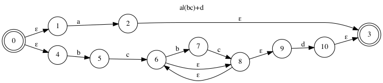
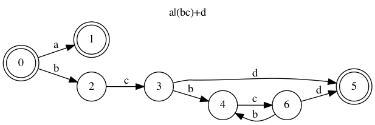

# py-regex-parser

Quick and dirty parser for simple regular expressions, written in Python as a weekend project (while reading through the [red dragon book](https://en.wikipedia.org/wiki/Compilers:_Principles,_Techniques,_and_Tools#First_edition)). Converts regex to syntax tree, generates non-deterministic finite automaton, then deterministic finite autamaton.

For example, here are diagrams of non-deterministic and deterministic finite autamata generated for `a|(bc)+d`.

